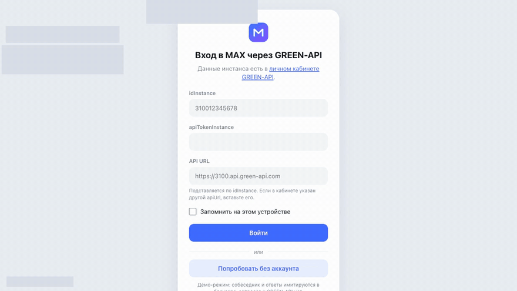
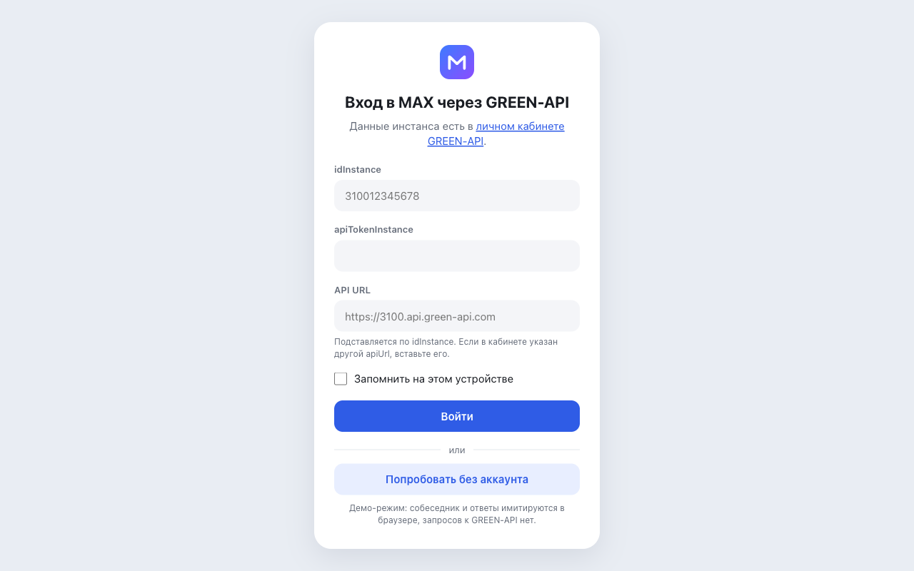
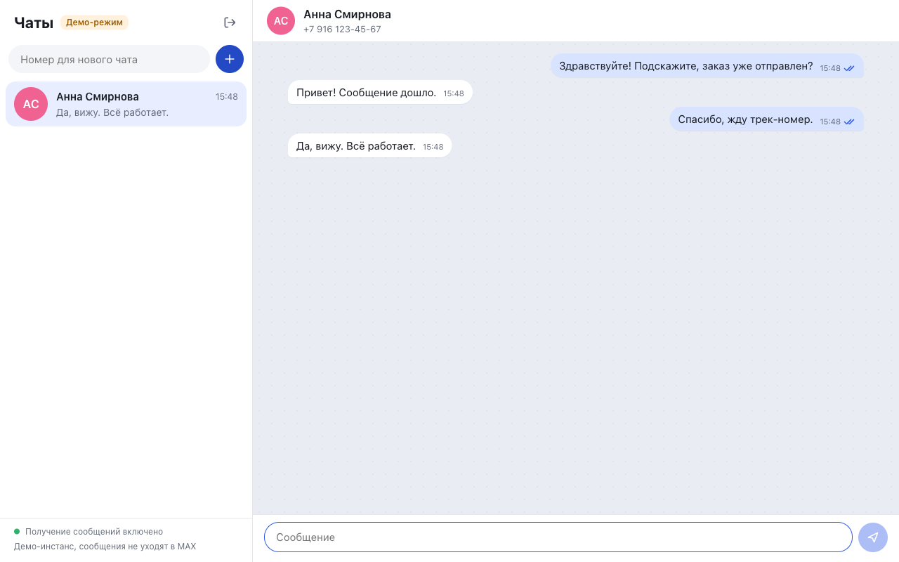
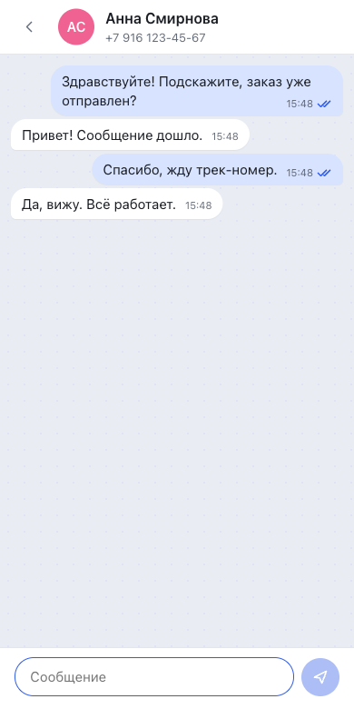

<!-- GIF с демонстрацией: положить файл в docs/screenshots/demo.gif и раскомментировать строку ниже. -->
<!--  -->

# MAX Chat на GREEN-API

[](https://github.com/ahrimmedia-beep/green-api-max-chat/actions/workflows/ci.yml)
[](https://github.com/ahrimmedia-beep/green-api-max-chat/actions/workflows/deploy.yml)


Минимальный веб-чат для отправки и получения текстовых сообщений в мессенджере MAX через [GREEN-API](https://green-api.com/max).
React 19, TypeScript, Vite. Внешний вид по мотивам [web.max.ru](https://web.max.ru/).

Сервис в интернете: https://ahrimmedia-beep.github.io/green-api-max-chat/
Без аккаунта GREEN-API можно нажать «Попробовать без аккаунта» на экране входа.

## Что умеет

- Вход по `idInstance` и `apiTokenInstance` (плюс `apiUrl` инстанса). Данные проверяются запросом `GetStateInstance`, ошибки показываются понятным текстом.
- Новый чат по номеру телефона получателя.
- Отправка текстового сообщения. Сообщение сразу появляется в чате со статусом «отправляется», затем «отправлено» или ошибка.
- Получение ответов в фоне. Ответ появляется в нужном чате; сообщение от нового собеседника создаёт чат в списке со счётчиком непрочитанных.
- Галочка «Запомнить на этом устройстве» сохраняет вход в браузере. Кнопка выхода удаляет данные и останавливает получение.
- Адаптивная вёрстка: на узком экране список чатов и переписка открываются по очереди.

## Что сверх ТЗ

Все дополнения остаются в рамках «только текст, минимум функций»: файлов, голосовых, групп и редактирования нет.

- Демо-режим без аккаунта: имитация GREEN-API в браузере, собеседник отвечает через 1–3 секунды, сессия помечена меткой «Демо-режим».
- Имена и аватары собеседников из MAX через `GetContactInfo`; если их нет, имя из уведомления, затем номер.
- Уведомления получает только одна вкладка (Web Locks API); остальные ждут и подхватывают работу, когда она закрывается.
- История чатов сохраняется в браузере отдельно для каждого инстанса (до 200 сообщений на чат) и удаляется при выходе.
- Отметки «доставлено» и «прочитано» по уведомлениям о статусах.
- Тёмная тема по системной настройке.
- Lighthouse 100 в категориях Performance, Accessibility, Best Practices и SEO.

## Скриншоты

<!-- Файлы login.png, chat.png и mobile.png положить в docs/screenshots/ -->

| Вход | Чат | Телефон |
|---|---|---|
|  |  |  |

## Подготовка аккаунта GREEN-API

1. Зарегистрируйтесь в [личном кабинете GREEN-API](https://console.green-api.com/).
2. Создайте инстанс для MAX. Для проверки подойдёт бесплатный тариф «Разработчик».
3. Авторизуйте инстанс. В приложении MAX на телефоне отключите пароль для входа (без этого вход по QR-коду сейчас не работает), откройте «Профиль», «Устройства», «Войти по QR-коду» и отсканируйте QR-код со страницы инстанса в кабинете.
4. На странице инстанса скопируйте `apiUrl`, `idInstance` и `apiTokenInstance`.
5. В настройках инстанса оставьте поле `webhookUrl` пустым и включите «Получать уведомления о входящих сообщениях и файлах». Для отметок «доставлено» и «прочитано» включите также уведомления о статусах отправленных сообщений. После сохранения настройки применяются примерно через минуту.
6. Для проверки нужен второй аккаунт MAX на номере РФ (+7) или Беларуси (+375): на него отправляем сообщение и с него отвечаем.

Пошагово в документации: [Перед началом работы](https://green-api.com/v3/docs/before-start/).

## Как пользоваться

1. Откройте сайт, введите `idInstance` и `apiTokenInstance`. Поле `API URL` заполняется автоматически по первым четырём цифрам `idInstance` (`3100…` даёт `https://3100.api.green-api.com`); если в кабинете указан другой адрес, вставьте его.
2. В левой колонке введите номер получателя (`+7 999 123-45-67`, `89991234567` и т. п.) и нажмите «+».
3. Напишите сообщение и нажмите Enter или кнопку отправки. Shift+Enter переносит строку.
4. Ответ из MAX появится в этом же чате. Статус получения виден внизу левой колонки.

## Локальный запуск

Нужен Node.js 22.12 или новее (в CI используется 24, версия указана в `.nvmrc`).

```bash
npm ci
npm run dev
```

Приложение откроется на http://localhost:5173. Бэкенд не нужен: браузер обращается к GREEN-API напрямую, API отвечает с `Access-Control-Allow-Origin: *`.

## Проверки и сборка

```bash
npm run lint        # ESLint
npm run typecheck   # TypeScript в строгом режиме
npm test -- --run   # Vitest, однократный прогон
npm run coverage    # тесты с отчётом о покрытии (v8)
npm run build       # сборка в dist/
npm run preview     # локальный просмотр сборки
```

189 тестов (Vitest, Testing Library, jsdom), покрытие строк 98%, операторов 96%. Тесты покрывают:

- клиент API: формирование адресов, тела запросов, разбор ответов, ошибки 400/401/403, сетевые сбои, таймауты, отмену;
- разбор уведомлений на примерах из документации и с живого инстанса: текст, текст со ссылкой, цитата, статусы, пропускаемые типы;
- редьюсер чатов: создание, имена, сортировка, статусы без отката назад, защита от дублей;
- цикл получения: удаление каждого уведомления, повтор с растущей паузой, остановка на ошибке авторизации, одна вкладка через Web Locks;
- хранение истории, демо-режим и компоненты: вход, создание чата, отправка, приход ответа, выход.

Для компонентных тестов есть поддельный GREEN-API (`src/test/fakeGreenApi.ts`) с очередью, которая ведёт себя как настоящая: отдаёт уведомление, пока его не удалили.

Lighthouse 13 (страница входа, сборка `npm run preview`, режимы desktop и mobile): Performance 100, Accessibility 100, Best Practices 100, SEO 100.

## Публикация на GitHub Pages

1. Создайте репозиторий `green-api-max-chat` на GitHub и отправьте код в ветку `main`.
2. В репозитории откройте Settings, Pages и в поле Source выберите GitHub Actions.
3. Каждый push в `main` запускает `.github/workflows/deploy.yml`: установка зависимостей, тесты, сборка, публикация. Сайт будет доступен по адресу https://ahrimmedia-beep.github.io/green-api-max-chat/.

Сборка использует относительные пути (`base: './'`), поэтому работает и в подкаталоге GitHub Pages, и на своём домене.
Если нужен абсолютный префикс, задайте его переменной: `BASE_PATH=/green-api-max-chat/ npm run build`.

Отдельный workflow `.github/workflows/ci.yml` прогоняет lint, typecheck, тесты и сборку на каждый push и pull request.

## Как устроено

```
src/
  api/
    greenApi.ts        типизированный клиент: GetStateInstance, CheckAccount, SendMessage, GetContactInfo,
                       ReceiveNotification, DeleteNotification; подменяемый fetch
    notifications.ts   разбор уведомлений в доменные события (чистые функции)
    polling.ts         цикл получения уведомлений с повторами
    errors.ts, auth.ts тексты ошибок и проверка входа
  hooks/
    useNotificationPolling.ts  запуск и остановка цикла в React, блокировка вкладки
    useContactInfo.ts          имена и аватары собеседников
  state/
    chatReducer.ts     чаты и сообщения на useReducer
  components/          LoginForm, ChatScreen, ChatList, NewChatForm, ChatWindow,
                       MessageBubble, MessageInput, ConnectionStatus, Avatar
  lib/                 номера телефонов, форматирование, хранение входа и истории, Web Locks
  demo/
    demoServer.ts      имитация GREEN-API для демо-режима (отдельный чанк, грузится по кнопке)
```

**Отправка.** В MAX собеседник определяется числовым `chatId`. По номеру его выдаёт метод `CheckAccount`, после чего `SendMessage` отправляет текст на этот `chatId`. Отправка напрямую на `79991234567@c.us` тоже возможна, но документация предупреждает: тогда сервер назначит чату другой идентификатор и ответы не удастся сопоставить с чатом. Поэтому чат создаётся через `CheckAccount`. На живом инстансе ответ пришёл с тем же `chatId`, что вернул `CheckAccount`.

**Получение.** Используется технология HTTP API, без вебхуков и собственного сервера. Цикл вызывает `ReceiveNotification` с `receiveTimeout`: сервер держит запрос, пока не появится уведомление (long polling). После обработки каждое уведомление удаляется через `DeleteNotification` по `receiptId`, в том числе уведомления, которые чат не показывает (картинки, смена статуса инстанса и т. п.). Очередь отдаёт уведомления строго по порядку, и пока первое не удалено, следующие не придут. Если удаление не прошло, уведомление придёт повторно, а редьюсер отбросит дубликат по `idMessage`.

При сетевой ошибке цикл повторяет запрос с паузой от 1 до 30 секунд. Ошибки 401 и 403 останавливают получение: повтор с неверными данными не поможет. При выходе или закрытии страницы незавершённый запрос отменяется через `AbortController`.

**Одна вкладка.** Очередь у инстанса одна, и две вкладки забирали бы уведомления друг у друга. Вкладка берёт блокировку Web Locks с именем инстанса и только после этого опрашивает очередь. Остальные вкладки показывают «Сообщения получает другая вкладка» и ждут; когда первая закрывается, блокировку получает следующая. В браузерах без Web Locks опрос идёт как обычно.

**Демо-режим.** Подменяется только `fetch` клиента: имитация отвечает так же, как GREEN-API, поэтому клиент, разбор уведомлений, цикл получения и интерфейс работают без изменений. Код имитации вынесен в отдельный чанк и в обычной работе не загружается.

Проверенные по документации и на живом инстансе детали API со ссылками: [docs/API-NOTES.md](docs/API-NOTES.md).

## Ограничения

- Только текстовые сообщения. Остальные типы входящих сообщений пропускаются (и удаляются из очереди).
- Если к инстансу параллельно подключён другой обработчик (бот, вебхук), сообщение получит тот, кто забрал его первым. Между вкладками одного браузера эту проблему решает Web Locks, между разными браузерами и устройствами нет.
- История хранится в браузере, на котором велась переписка. Сообщения, отправленные с телефона, в чате не показываются. В демо-режиме история не сохраняется.
- Номера только РФ (+7) и Беларуси (+375): это ограничение `CheckAccount` в MAX.
- На тарифе «Разработчик» действуют лимиты на число чатов и проверок номеров.
- Отметка «прочитано» зависит от MAX: на живом инстансе статус `read` приходил не всегда, тогда сообщение остаётся «доставлено».
- `apiTokenInstance` передаётся в адресе запроса (так устроен API). При включённой галочке «Запомнить» данные хранятся в `localStorage` браузера без шифрования.
